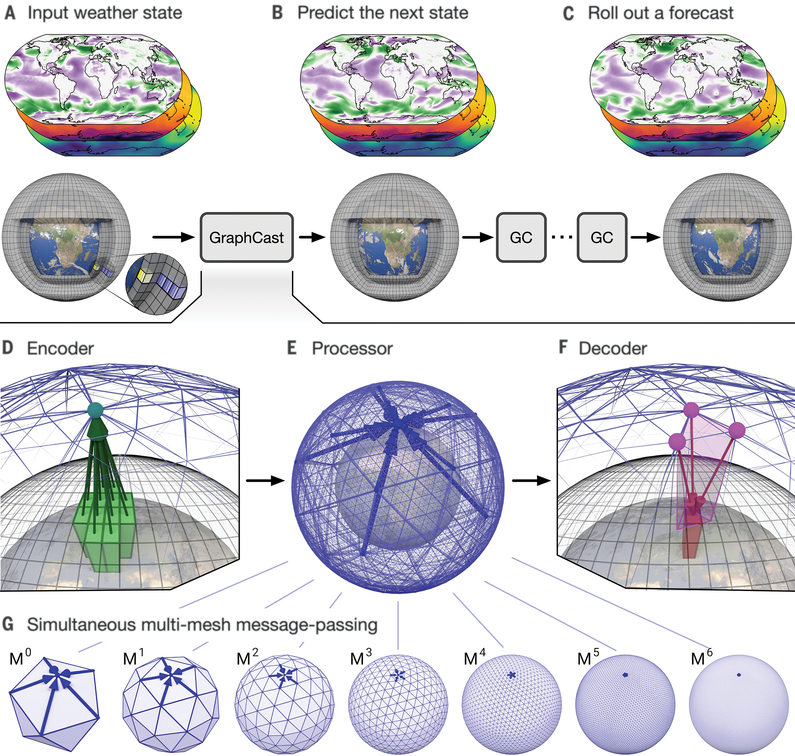

I have always been quite interested in learning about applications of deep learning for science and engineering. I
recently surveyed some papers from Deepmind on their attempts at the weather prediction task. 

They have two models that I want to review: [GraphCast](https://www.science.org/stoken/author-tokens/ST-1550/full) and [GenCast](https://www.nature.com/articles/s41586-024-08252-9).

## GraphCast

### Data Modeling

They represent the state of the world at the current time $t_0$ and the previous step $t_{-6h}$.

The earth is represented as a large lat/lon grid at 0.25 degree angular discretization. This leads to a 721x1440 cell
grid, or ~1M cells representing the state of the earth. Each cell has 5 surface variables and 6 atmospheric variables at
37 pressure levels, leading to 5 + 6*37 = 227 state variables per grid cell. 

| Surface | Atmosphere | 
| ---     | ---        |
| temp    | temp       | 
| U, V wind component | U, V, W wind component|
| mean sea level pressure | geopotential |
| total precipitation | specific humidity |

### Model Architecture

The flow of data through the model is through a series of processing steps.

Input -> Encoder -> Processor -> Decoder -> Output (rollout uses this as the input for the next step)

[comment]: # Try this later: 

#### Encoder

The encoder is an embedding model that pools local grid points into a point on a mesh representation of the globe. This
mesh is a multi-scale mesh where an icosahedron is subdivided multiple times. This allows message passing to happen on a
variety of distance scales in a single step.

#### Processor

The processor is the model reponsible for running the actual simulation of weather. Once we have a multi-mesh of the
current state of the earth, a message-passing GNN is used to perform several rounds to simulate the dynamics over the
next 6hr time interval.

#### Decoder

The decoder essentially performs the reverse of the encoder model, taking meshpoints and projecting them back onto the
original lat/lon mesh.

### Training, Results, and Limitations

The model is trained in a curriculum fashion, starting with a lower resolution state grid, and then a second round of
training finetunes on the final resolution.

The loss function is defined as the MSE loss against [ERA5](https://cds.climate.copernicus.eu/datasets/reanalysis-era5-single-levels?tab=overview) 
estimates of predicted state. A similar curriculum is used where a progressive rollout strategy from a single step (6hrs) to 12 steps (3 days).

The main limitations of this model were the MSE loss encourages predictions that are "blurry", where overtime the
rollouts capture the general trend of the dynamics, but unable to distinguish any short length scale behavior.
Additionally, these types of models do not have any sort of uncertainty quantification or confidence estimates in their
predictions. Without this, these models do not have a lot of utility on their own and so more work needed to be done in
this direction.

## GenCast
 
GenCast inherits many of the same data and architectural modeling strategies, but with a few modernizations and
techniques to tackle the limitations listed before.

The main distinction between these models is that GenCast is meant to provide many different trajectories since it is a
generative model using the current state as a seed. This means that these trajectories can be ensembled together and
used as a sort of uncertainty estimate over time.

### Data Modeling

Similar to GraphCast, there surface and atmospheric variables at several pressure levels but they also provide some
static variabls this time as well:

|Atmosphere |Surface |Static|
|--- |--- |---|
|U, V, W wind components| U, V wind components | geopotential at surface|
|geopotenial| pressure| land/sea mask|
|temp| temp| lat/lon|
|| sea surface temp| time of day|
|| total precipatation | year progress|

### Model Architecture

The general architecture is similar to GraphCast, but the models used for each step have been swapped out.

Input -> Encoder -> Processor -> Decoder -> Output (connect as input for rollout)

#### Encoder and Decoder

These are the same type of networks as before, except they do not need to embed/decode to a multi-mesh. The authors
simplified the data setup with only the highest resolution mesh, an icosahedron split 6 times.

#### Processor

The processor is a graph transformer network that performs attention to a k-hop neighborhood.

### Training and Results

This is a denoising diffusion model, which I am hoping to review these at some point. Essentially, they are trained to
denoise progressively corrupted versions of their input until they are able to generate likely inputs from sampled
noise. Many modeling choices had to be fixed when building a diffusion model: noise schedule, noise scaling,
preconditioning, and the loss weighting at different noise levels. These are all important parts of designing the
network properly.

In this application, the loop is visualized rather well by the image below. The input is taken and combined with
randomly sampled spherical noise into $r_{\theta}$, which represents the encoder, processor, and decoder to refine the
corrupted input in several stages. A diffusion solver is used in conjunction with this model and inputs to iteratively
refine the estimate of the next time step. This can then be fed back with another sampled noise to continue a rollout in
time.

One can see how if you start with several sampled noise vectors, then several predictions can be rolled out in time.
This allows the model to concentrate from several different starting positions what trajectories are most likely to
happen given its training data.

